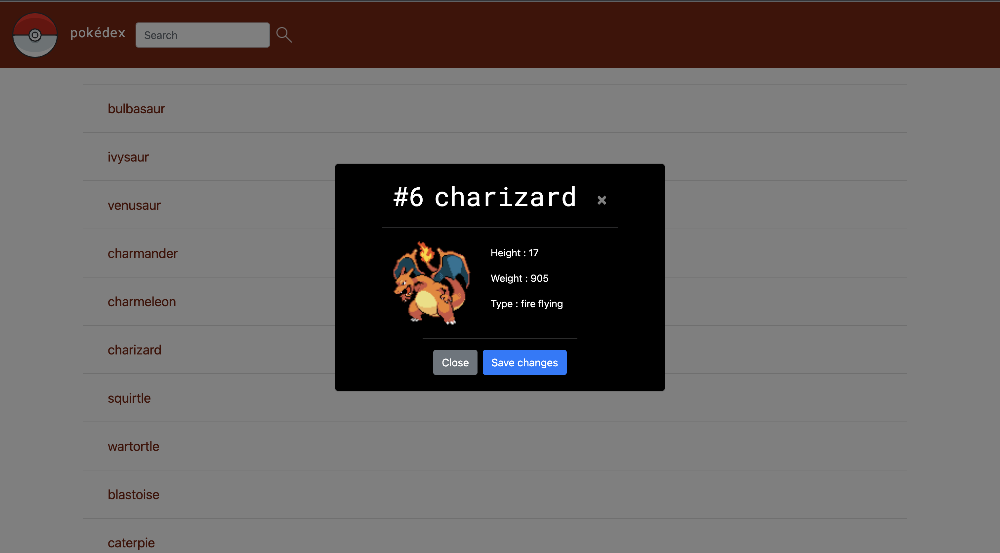

# Pokédex
## Project description
I created a web application using HTML, CSS and JavaScript that loads data from an external API and enables the viewing of data points in detail.
## How to get the project running
* Load data from a public API.
* View a list of items.
* Accept user actions for veiwing details of items.
## APIs
https://pokeapi.co/api/v2/pokemon/?limit=120

## Technologies
HTML, CSS, Javascript
## Libraries
Jquery and Bootstrap

## Page sketch

## Final site
This is the final look of the site. When you click on a pokémon, it pops up a card with details about the pokemon you clicked.

Pokémon card is revealed when a pokémon name is clicked as shown below.

